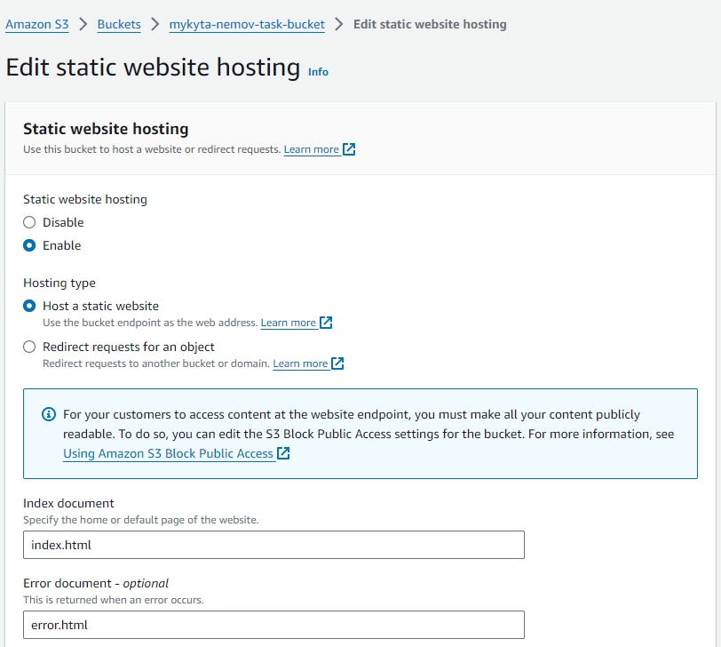
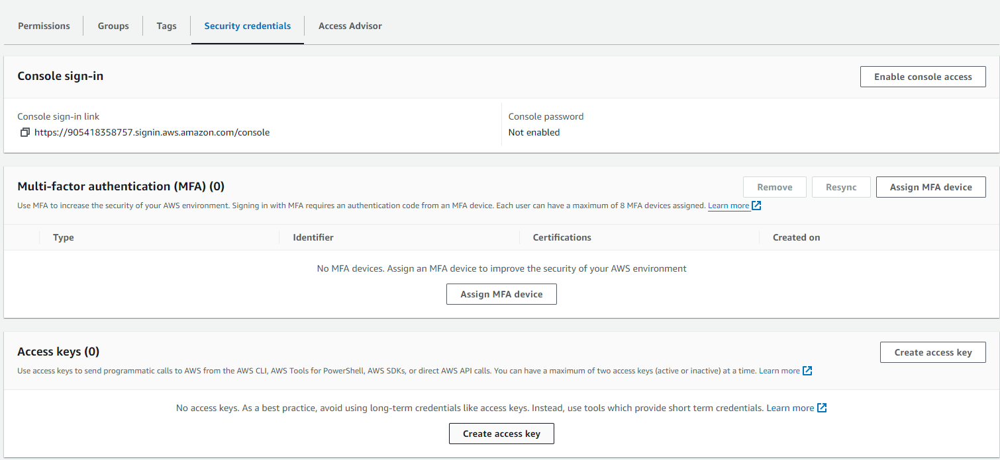

# Static Website Hosting on AWS S3 with GitHub Actions

I can divide the task execution into 4 subtasks:

1. Creating a static website
2. Creating an S3 Bucket and hosting the static website
3. Creating an IAM user for GitHub Actions
4. Creating a workflow in GitHub Actions

## Creating a static website
First, it was necessary to create a static website. For this purpose, a simple index.html page and styles.css were used.

The files were saved in a private GitHub repository.
 
 
 

## Creating an S3 Bucket and hosting the static website
After this, it was necessary to create an S3 Bucket. The eu-central-1 (Frankfurt) location was chosen for lower latency when loading the site from Ukraine.

A name was chosen for the S3 Bucket, and public access blocking was disabled.
  
 
 
 
It was decided to enable versioning for the S3 Bucket, in case it becomes necessary to revert to a previous version of the site files.

  

After creating the S3 Bucket, it was necessary to go to the "Properties" tab to activate static website hosting in "Static website hosting".

 
 
In the static website host activation settings, it was necessary to specify the Index and Error documents.

 
After activating the static website host, it needed to be made public. For this, the "Bucket Policy" was changed in the S3 Bucket "Permissions" tab.
 

 

Then, the static website files were uploaded to the empty S3 Bucket.
 
 
 
 
After this, it was possible to access the website via the bucket endpoint.
 
 

The page looked like this:

 

## Creating an IAM user for GitHub Actions
After the static website was created, it was necessary to set up its automatic deployment from the repository when pushing a new version. For this, a special user was created that could upload new files from the repository. Such a user was created in the IAM service.
 

 

In my opinion, the "AmazonS3FullAccess" policy is excessive for a user who should only upload files. It is necessary to follow the practice of granular access.
 
  

A policy was created that only allowed uploading files to my S3 Bucket and nowhere else.
 
  

This policy was applied to the deployment user.
 

For GitHub Actions to manage the user, it needs access keys.
 

The access keys were saved for further use.

## Creating a Workflow in GitHub Actions
After this, in the repository settings under the "Actions" tab in "Secrets and values", the user's Access Key and Secret Key were added.
 

Then, the access keys were passed as arguments within the deployment pipeline. The site files have now been moved to the "static" folder to prevent other folders and files from being deployed to S3

 
To check functionality, the heart was changed from red to blue and yellow.

 The workflow ran successfully, and the deployment of the new file version was applied.
 

The page now looks like this:

 
As part of the task, the following steps were completed: a static website was created with index.html and styles.css files, an S3 Bucket was configured for website hosting with versioning enabled and public access, an IAM user was created with minimal permissions to upload files to S3, and a workflow in GitHub Actions was set up for automatic site deployment when pushing a new version to the repository.

The site is located at the link:
http://mykyta-nemov-task-bucket.s3-website.eu-central-1.amazonaws.com/
